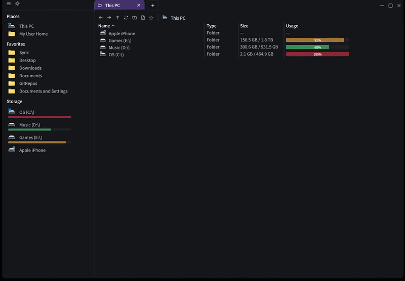

  

<h1 align="center">EdenExplorer</h1>

  

  <b>Blazing-fast, open-source file manager for Windows 11.</b>

  A next-generation file explorer built with Rust and egui, 
  focused on performance, efficiency, and modern workflows.

  A fast, open-source alternative to Windows File Explorer.

  
  
  
  

  

<h1 align="center"> ⭐ Support</h1>

  If you like this FOSS project, consider sponsoring

  

<h1 align="center">⚡ Why EdenExplorer?</h1>

  Windows File Explorer hasn't evolved for modern workflows.  
  It's slow, inefficient, and built for a different era.

  <b>EdenExplorer fixes that.</b>

  <b>Powered by direct NT-level filesystem access for maximum performance.</b>

 

  ⚡ <b>Lightning-fast performance</b> — minimal overhead 
  🧠 <b>Efficient by design</b> — Built in Rust for memory safety and speed 
  🎯 <b>Minimal, modern UI</b> — Clean, distraction-free interface that just works 
  🔓 <b>100% Free & Open Source</b> — No telemetry, no lock-in, no nonsense 
  🪶 <b>Lightweight footprint</b> — Uses a fraction of the resources of Explorer 
  🧰 <b>Built for daily use</b> — Your new go-to file manager for everything

<h1 align="center"> 🧩 Built With Modern Technology </h1>

  🦀 <b>Rust</b> — Safe, fast, and reliable systems programming 
  🎨 <a href="https://github.com/emilk/egui/"><b>egui</b></a> — Immediate mode GUI for ultra-responsive interfaces 
  📦 <a href="https://github.com/amPerl/egui-phosphor"><b>egui-phosphor</b></a> — <a href="https://github.com/phosphor-icons/homepage">Phosphor</a> icon set for egui 
  ⚙️ <b>NT-level filesystem access</b> — Maximum performance, minimal abstraction

<h1 align="center"> Comparison </h1>

<table>
  <thead>
    <tr>
      <th>Feature</th>
      <th><b>EdenExplorer</b></th>
      <th>FilePilot</th>
      <th>Windows Explorer</th>
      <th>Files App</th>
      <th>Directory Opus</th>
      <th>Total Commander</th>
      <th>XYplorer</th>
      <th>Explorer++</th>
      <th>Double Commander</th>
    </tr>
  </thead>
  <tbody>
    <tr>
      <td><b>Pricing</b></td>
      <td><b>✅ Free</b></td>
      <td>❌ Paid</td>
      <td>❌ Your Data</td>
      <td>✅ Free</td>
      <td>❌ Paid</td>
      <td>❌ Paid</td>
      <td>❌ Paid</td>
      <td>✅ Free</td>
      <td>✅ Free</td>
    </tr>
    <tr>
      <td><b>Performance</b></td>
      <td><b>⚡ Fast</b></td>
      <td>⚡ Fast</td>
      <td>🐢 Slow</td>
      <td>⚡ Fast</td>
      <td>⚡ Fast</td>
      <td>⚡ Fast</td>
      <td>⚡ Fast</td>
      <td>⚡ Fast</td>
      <td>⚡ Fast</td>
    </tr>
    <tr>
      <td><b>Open Source</b></td>
      <td><b>✅ Yes</b></td>
      <td>❌ No</td>
      <td>❌ No</td>
      <td>✅ Yes</td>
      <td>❌ No</td>
      <td>❌ No</td>
      <td>❌ No</td>
      <td>✅ Yes</td>
      <td>✅ Yes</td>
    </tr>
    <tr>
      <td><b>NT-level access</b></td>
      <td><b>✅ Yes</b></td>
      <td>✅ Yes</td>
      <td>❌ No</td>
      <td>❌ No</td>
      <td>✅ Yes</td>
      <td>✅ Yes</td>
      <td>❌ No</td>
      <td>❌ No</td>
      <td>❌ No</td>
    </tr>
    <tr>
      <td><b>Resource Usage</b></td>
      <td><b>🪶 Low</b></td>
      <td>🪶 Low</td>
      <td>🧱 Heavy</td>
      <td>🪶 Low</td>
      <td>🧱 Heavy</td>
      <td>🪶 Low</td>
      <td>🪶 Low</td>
      <td>🪶 Low</td>
      <td>🪶 Low</td>
    </tr>
    <tr>
      <td><b>Core Technology</b></td>
      <td><b>🦀 Rust</b></td>
      <td>🦀 Rust</td>
      <td>⚙️ C++*</td>
      <td>💙 C# / WinUI</td>
      <td>⚙️ C++</td>
      <td>⚙️ Delphi (Object Pascal)</td>
      <td>⚙️ C++*</td>
      <td>⚙️ C++</td>
      <td>⚙️ Free Pascal (Lazarus)</td>
    </tr>
  </tbody>
</table>

<h2 align="center">🚀 Getting Started</h2>
<h3 align="center">Download</h3>

  Grab the latest release from: 
  <a href="https://github.com/mtucciarone/EdenExplorer/releases">
    https://github.com/mtucciarone/EdenExplorer/releases
  </a>

  Just download and launch — no installation, no setup.

<h2 align="center">✨ Features</h2>

<table align="center" style="border: none; border-collapse: collapse;">
<tr>
<td width="50%" valign="top" style="border: none; padding: 12px;">

<h3>Core Functionality</h3>
<ul>
  <li><b>Lightning-fast GUI</b> that starts at the <b>root of your computer</b>, displaying all drives with comprehensive storage types and detailed information</li>
  <li><b>Asynchronous directory scanning</b> for ultra-fast file listing without blocking the UI</li>
  <li><b>Intuitive navigation</b> with <b>Back / Forward / Up</b> controls for seamless browsing</li>
  <li><b>Smart sidebar</b> with quick access to common folders and customizable favorites</li>
</ul>

<h3>Theme & Customization</h3>
<ul>
  <li><b>Dark/Light mode switching</b> with instant toggle</li>
  <li><b>Advanced theme customization</b> with full color palette editor</li>
  <li><b>Customizable startup directory</b></li>
  <li><b>Persistent settings</b> across restarts</li>
</ul>

<h3>Search & Filtering</h3>
<ul>
  <li><b>Real-time file filtering</b> as you type</li>
  <li><b>Fuzzy matching</b> for intelligent results</li>
  <li><b>Performance-optimized filtering</b> with cached indices</li>
</ul>

</td>

<td width="50%" valign="top" style="border: none; padding: 12px;">

<h3>User Interface & Navigation</h3>
<ul>
  <li><b>Tabbed navigation</b> with independent loading states</li>
  <li><b>Interactive breadcrumb navigation</b> with inline editing</li>
  <li><b>Responsive design</b> across window sizes</li>
  <li><b>Modern toolbar</b> with file and folder actions</li>
</ul>

<h3>Advanced Features</h3>
<ul>
  <li><b>Favorites system</b> with drag-and-drop support</li>
  <li><b>Background folder size calculation</b> with progress tracking</li>
  <li><b>Context menu operations</b> (cut, copy, paste, rename, delete)</li>
  <li><b>Drag and drop files/folders</b> within the viewer</li>
  <li><b>Portable device support</b> (iPhone, Android, external devices)</li>
  <li><b>Raw/unmounted drive detection</b> (ISO, Linux partitions)</li>
</ul>

<h3>System Integration</h3>
<ul>
  <li><b>Persistent settings</b> using efficient binary cache</li>
  <li><b>Efficient drive space queries</b> with caching</li>
  <li><b>Windows API integration</b></li>
  <li><b>Custom executable icon</b> with file association</li>
  <li><b>Improved window management</b></li>
</ul>

<h3>Performance Optimizations</h3>
<ul>
  <li><b>NT-level filesystem access</b> via direct API calls</li>
  <li><b>Background scanning</b> prevents UI freezing</li>
  <li><b>Efficient caching</b> for directories and metadata</li>
  <li><b>Streaming directory enumeration</b></li>
  <li><b>Low memory footprint</b></li>
  <li><b>Built-in benchmarking system</b></li>
</ul>

</td>
</tr>
</table>

## 🗺️ Roadmap

### ✅ Implemented Features
- [x] **Tabbed interface** with tab management and navigation
- [x] **Search and filter engine** with real-time file indexing
- [x] **Dark/Light theme switching** with toggle controls
- [x] **Comprehensive navigation** with back/forward/up controls
- [x] **Favorites system** with drag-and-drop support
- [x] **Favorites management** with reset and reorganization capabilities
- [x] **Context menu operations** (cut, copy, paste, rename, delete)
- [x] **Enhanced drive caching** with 30-second cache duration for improved UI performance
- [x] **Optimized icon caching** with metadata-based cache keys and background loading
- [x] **Folder size scanning control** with user setting to enable/disable performance-heavy operations
- [x] **Window size customization** with fullscreen, half-screen, and custom dimension modes
- [x] **Portable device support** for iPhone, Android, and other connected devices
- [x] **Raw/unmounted drive detection** for ISO sticks and Linux partitions
- [x] **Performance benchmarking system** with real-time measurement and comparison tools
- [x] **Drag and drop files/folders** - Move one or more items into folders shown in the item viewer
- [x] **Window management improvements** with proper maximization bounds and minimum size constraints
- [x] **File/Directory filtering** - typing characters automatically start filtering items in the item viewer
- [x] **Windows environment variables PATH support** - Automatically expands Windows PATHs in breadcrumb input

### 🚀 Upcoming Features
- [ ] **Image previews using Spacebar** - GPU texture via wgpu / egui_wgpu_backend
  - Decodes image once, uploads to GPU, renders instantly
  - Even very large images (>10k×10k) show instantly
  - Minimal CPU overhead
  - Best for "popup over app" with no lag
- [ ] Drag and drop files into breadcrumb folders
- [ ] Support network devices

## 🐛 Known Bugs
- After hitting "Enter" when renaming a new file/folder, it should automatically select that item in the itemviewer
- Dragging and dropping files into empty folders/directories doesn't do anything
- Hitting "Shift" after already shift-selecting files drops the entire file selection
- Entering "%appdata%" in the breadcrumbs/path throws an invalid path errors

## Star History

<a href="https://www.star-history.com/?repos=mtucciarone%2FEdenExplorer&type=date&legend=top-left">
 <picture>
   <source media="(prefers-color-scheme: dark)" srcset="https://api.star-history.com/image?repos=mtucciarone/EdenExplorer&type=date&theme=dark&legend=top-left" />
   <source media="(prefers-color-scheme: light)" srcset="https://api.star-history.com/image?repos=mtucciarone/EdenExplorer&type=date&legend=top-left" />
   
 </picture>
</a>

## License
This project is FOSS, released under the MIT License.
